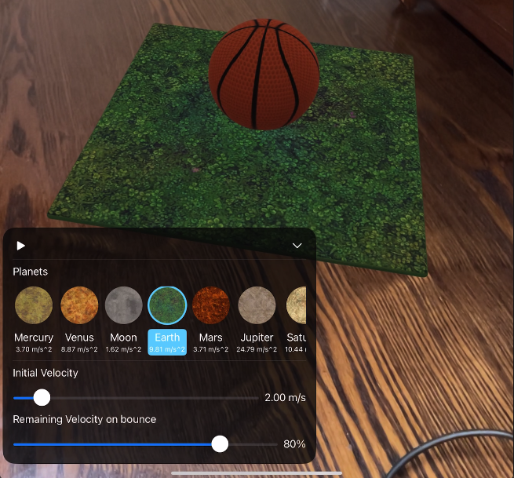

# Planets Gravities

## What's in this project
This project aims to provide a straightforward example for Apple's RealityKit framework. It includes:
- A ball with an initial velocity is thrown, and on each frame, its distance from the ground is calculated and rendered in the correct position.
- A configurable environment with options for changing RealityKit object behaviors, such as selecting different planets resulting in varying gravity forces, adjusting the velocity and bouncing behavior of the ball, and updating the UI based on the falling state.
- Follows the ESC (Entity, System, Component) architecture and its best practices.
## Related resources
* [Understanding RealityKit’s modular architecture](https://developer.apple.com/documentation/visionos/understanding-the-realitykit-modular-architecture)
* [ Implementing systems for entities in a scene](https://developer.apple.com/documentation/RealityKit/implementing-systems-for-entities-in-a-scene)
